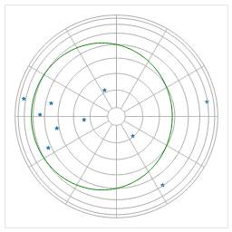

Usage
=====

Introduction
------------

``uranography`` is a collection of classes that supply tools for making
``bokeh`` plots of data on the celestial sphere. It is primarily intended for 
use in interactive environments such as jupyter notebooks or dashboards. For
instructions on using it in such envirenments, see the example notebook,
``uranography.ipynb``, in the ``notebooks`` directory of the repository.

The following examples show use in creation of non-interactive plots, saved
as png files.

Although some common plots are straightforward using ``uranography``
commands alone, in general the tools are intended as a supplement to the
using ``bokeh`` directly, and not for use use as a replacement interface
to it.

Creating test data for example use
----------------------------------

Begin by creating some sample data to plot, a ``pandas.DataFrame`` of
the brightest stars:

.. code-block:: python

 import pandas as pd

 stars_df = pd.DataFrame(
    [
        {"name": "Sirius", "coords": (101.3, -16.7), "Vmag": -1.46},
        {"name": "Canopus", "coords": (96.0, -52.7), "Vmag": -0.72},
        {"name": "Arcturus", "coords": (213.9, 19.2), "Vmag": -0.04},
        {"name": "Alpha Centauri", "coords": (219.9, -60.8), "Vmag": -0.01},
        {"name": "Vega", "coords": (279.2, 38.8), "Vmag": 0.03},
        {"name": "Capella", "coords": (79.2, 46.0), "Vmag": 0.08},
        {"name": "Rigel", "coords": (78.6, -8.2), "Vmag": 0.12},
        {"name": "Procyon", "coords": (114.8, 5.2), "Vmag": 0.38},
        {"name": "Achemar", "coords": (24.4, -57.2), "Vmag": 0.46},
        {"name": "Betelgeuse", "coords": (88.8, 7.4), "Vmag": 0.5},
    ]
   )

A basic plot of points on the sky
---------------------------------

The ``uranography`` tools consist of a collection of classes, each of
which implements a different map projection for the sky.

In our first example, we will using the ``Planisphere`` class, which
implements Lambert Azimuthal Equal Area projection.

Begin by creating an instance of the ``Planisphere`` class, called
``sky``.

After instantiation, ``sky`` will have a ``plot`` member, which is a
perfectly normal instance of ``bokeh.plotting.Figure``, and we can add
elemnts to the figure using the standard complement of members of that
class supplied by ``bokeh``.

``sky`` also provides transform methods that convert columns in a data
source with ra, declination pairs (in degrees) to ``x`` and ``y``
projection coordinates.

The ``decorate`` method adds a stardard complement of “decorations” for
sky maps: graticules for R.A. and declination, the ecliptic, and the
galactic plane.

Finally, the ``show`` method of ``sky`` displays the plot (if you are
running in a jupyter notebook in which you have run
``bokeh.io.output_notebook()``.

.. code-block:: python

 import bokeh.io
 from uranography.api import Planisphere

 sky = Planisphere()
 sky.plot.star(
     sky.x_transform("coords"),
     sky.y_transform("coords"),
     source=stars_df)
 sky.decorate()

 # sky.show(); # If we were in a notebook
 saved_file = bokeh.plotting.save(sky.figure, filename='usage_figures/basic_planisphere.html')

.. raw:: html
   :file: usage_figures/basic_planisphere.html

You can take greater control by instantiating instance of
``bokeh.plotting.Figure`` yourself and passing it as an argument when
creating ``sky``.

Also, instead of using the standard decorations supplied by
``decorate``, you can add the elements you want individually.

Finally, this example saves the result to a non-interactive png, rather
than a interactive html.

.. code-block:: python

 import bokeh
 
 plot = bokeh.plotting.figure(
     plot_width=256,
     plot_height=256,
     match_aspect=True,
 )
 sky = Planisphere(plot=plot)
 plot.star(
     sky.x_transform("coords"),
     sky.y_transform("coords"),
     source=stars_df)
 sky.add_graticules()
 sky.add_ecliptic()

 # sky.show(); # If we were in a notebook
 sky.plot.toolbar_location = None ;# Do not show the toolbar in the saved png
 saved_file = bokeh.io.export_png(sky.plot, filename='usage_figures/adjusted_planisphere.png')

Plotting a healpix map
----------------------

.. code-block:: python

 import healpy as hp
 from uranography.api import MollweideMap
 
 dust = hp.read_map(
     #    "https://lambda.gsfc.nasa.gov/data/foregrounds/SFD/lambda_sfd_ebv.fits"
     "lambda_sfd_ebv.fits"
 )
 
 plot = bokeh.plotting.figure(
     plot_width=512,
     plot_height=256,
     match_aspect=True,
 )
 sky = MollweideMap(plot=plot)
 sky.add_healpix(dust)

 # sky.show(); # If we were in a notebook
 saved_file = bokeh.plotting.save(sky.figure, filename='usage_figures/basic_healpix.html')

.. raw:: html
   :file: usage_figures/basic_healpix.html

Details of the plot can be adjusted either through arguments to
``add_healpix`` or by using ``select`` to find the relevant ``bokeh``
model and adjusting directly, as you would when fine tuning any
``bokeh`` plot.

The healpix maps and decorations supplied by ``uranography`` have default
names that can be used to ``select`` them for adjustment, or they can be
set using arguments to their respective methods.

For example, use ``bokeh`` to use a histogram equalized grayscale color
map, with each healpixel outlined in red:

.. code-block:: python

 import healpy as hp
 from uranography.api import MollweideMap

 dust = hp.read_map(
     #    "https://lambda.gsfc.nasa.gov/data/foregrounds/SFD/lambda_sfd_ebv.fits"
     "lambda_sfd_ebv.fits"
 )

 plot = bokeh.plotting.figure(
     plot_width=512,
     plot_height=256,
     match_aspect=True,
 )
 sky = MollweideMap(plot=plot)

 # Example of tweaking the appearance of the healpix map
 # using arguments to add_healpix
 cmap = {
     "field": "value",
     "transform": bokeh.models.EqHistColorMapper(palette="Greys256"),
 }

 sky.add_healpix(dust, cmap=cmap) #doctest: +ELLIPSIS

 # Example of tweaking the appearance of the healpix map
 # by setting members of bokeh models directly
 sky.plot.select("hpix_renderer").glyph.line_color = "red"

 # sky.show(); # If we were in a notebook
 saved_file = bokeh.plotting.save(sky.figure, filename='usage_figures/adjusted_healpix.html')

.. raw:: html
   :file: usage_figures/adjusted_healpix.html

Figures that depend on time and observer location
-------------------------------------------------

Some projections and decoraction depend on the time, the location of the
observer, or both.

These parameters can be passed in the creation of the instance of
``SphereMap``, and some can be adjusted using sliders.

Note the call of the ``connect_controls`` method after the data points
(in ``stars``) are added to this map. This causes the project values of
the positions to be updated when the sliders are adjusted.

.. code-block:: python

 from astropy.time import Time
 from astropy.coordinates import EarthLocation
 from uranography.api import HorizonMap

 current_time = Time.now()
 location = EarthLocation.of_site("Cerro Pachon")

 plot = bokeh.plotting.figure(
     height=256,
     width=256,
     match_aspect=True,
 )
 sky = HorizonMap(mjd=current_time.mjd, location=location, plot=plot)
 stars = bokeh.models.ColumnDataSource(stars_df)
 plot.star(
     sky.x_transform("coords"),
     sky.y_transform("coords"),
     source=stars,
 ) 

 sky.connect_controls(stars)
 sky.add_horizon_graticules()
 sky.add_ecliptic()

 # sky.show(); # If we were in a notebook
 saved_file = bokeh.plotting.save(sky.figure, filename='usage_figures/simple_horizon.html')

.. raw:: html
   :file: usage_figures/simple_horizon.html
